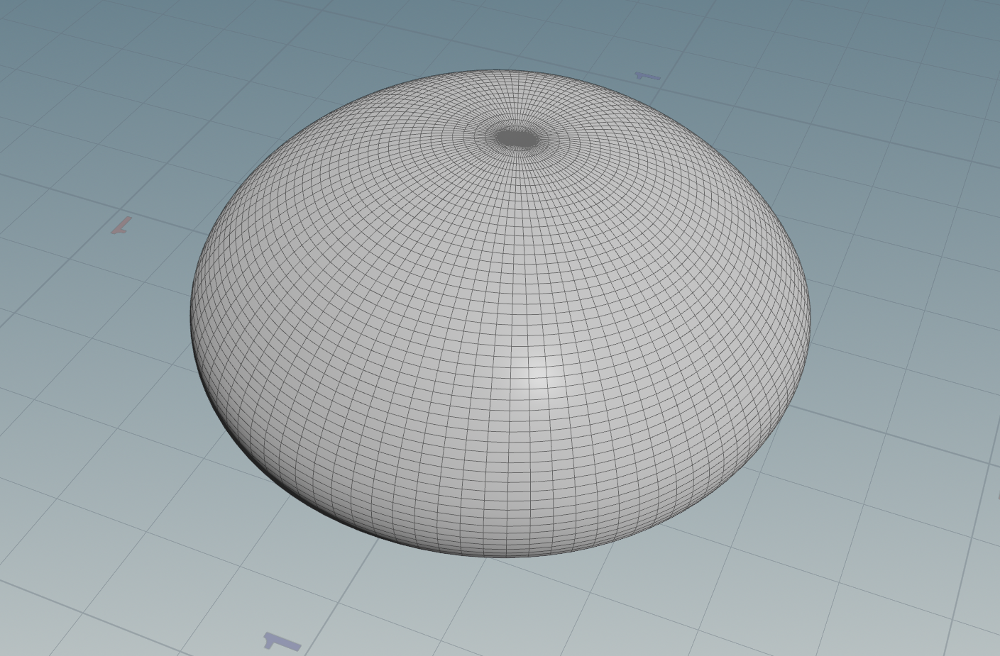
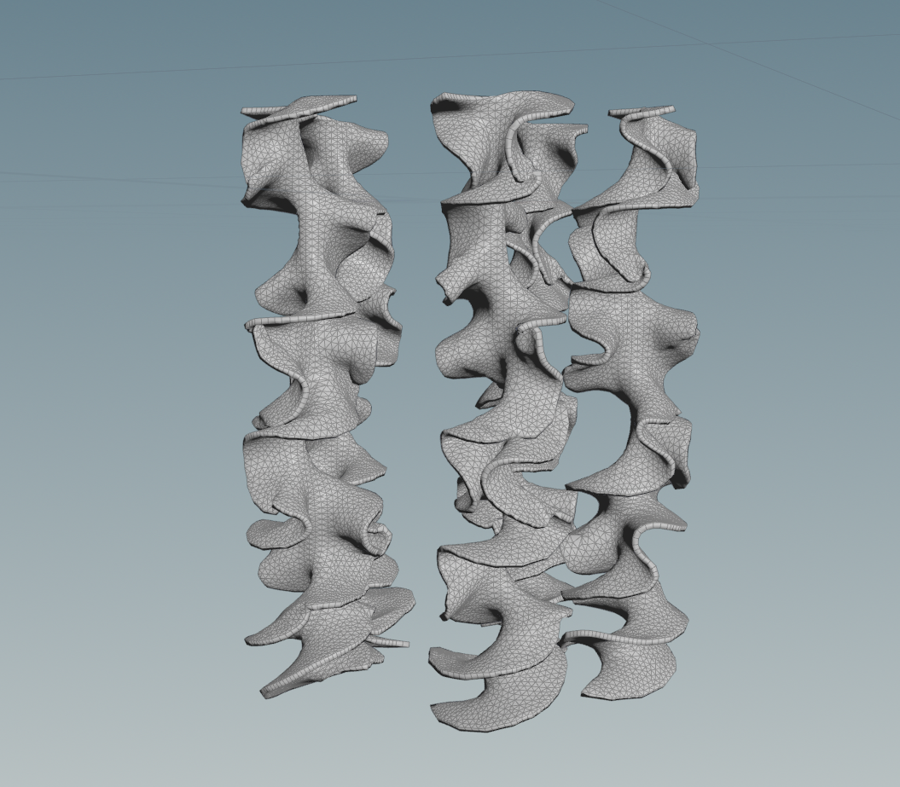
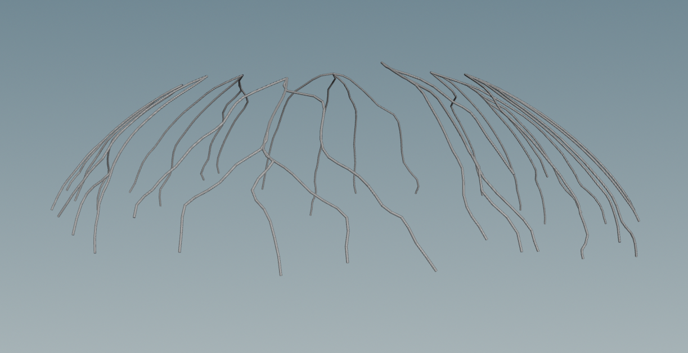
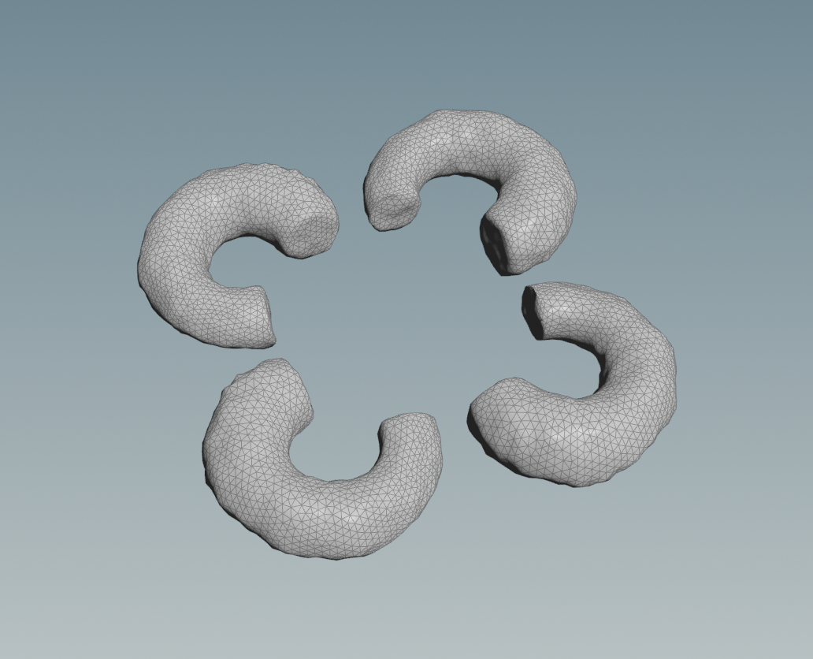
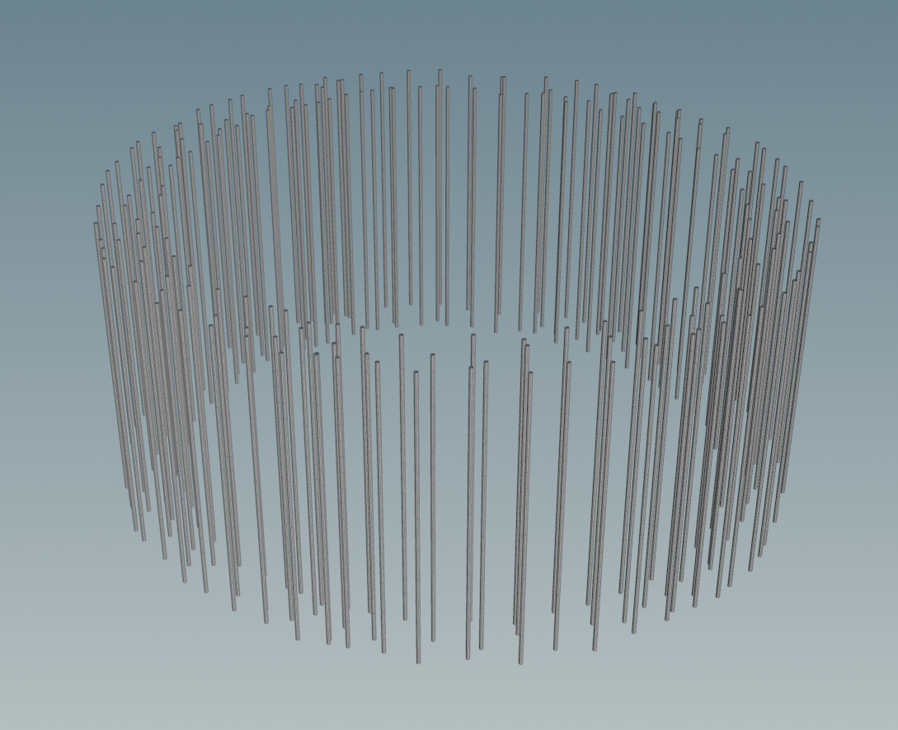

# Procedural Jellyfish

## Project Overview

This is a simple jellyfish build with Houdini. Here's a demo video for my jellyfish

(Previous README.md has changed name as INSTRUCTION.md aside)

## Components

### Bell

This is the bell shape for the head of the jellyfish. By following the tutorial, I use two bends on both ends of one line, and then match the size and revolve by Y axis to build the primitive shape. Then fuse and mountain are used to add noise to make organic look. Also, a controller NULL node is created to control relative parameters as references.

Then, I have also added keyframes for the bell for animation within 100 frames. This is later frequently referenced for other parts' animation.

### Arms

This is the arms for the jellyfish. By following the tutorial, I have created a thin grid, then add ruffles, twist, and remesh to create a primitive version. After that, I created copies to make in total five arms, pinned a few points at the top, and link to the animation created for the bell above. The rest part I have them act as cloths within the animation and set the parameter to let them visually look like they are in the water.

## Veins

By fixing the first frame of the bell and remesh it, I may then manually generate two groups of points on the bell and then form shortest paths from any start to each end. Then I use smooth and sweep and finally bind the animation of the bell to the veins.

## Organs

This organ is also created by myself starting with a line and bend it for 270 degrees. Then I sweep and remesh it for better mesh look, and then use mountain to create more organic look. Finally I make four copies by rotating it around a center point.

## Tentacles

Instead of directly taking points from the base of the bell, I check the video and make a torus to get scatter points from it and generate copies of lines for each scatter point. After using sweep, I did things similar to what I have done to arms to bind the animation to the tentacles.